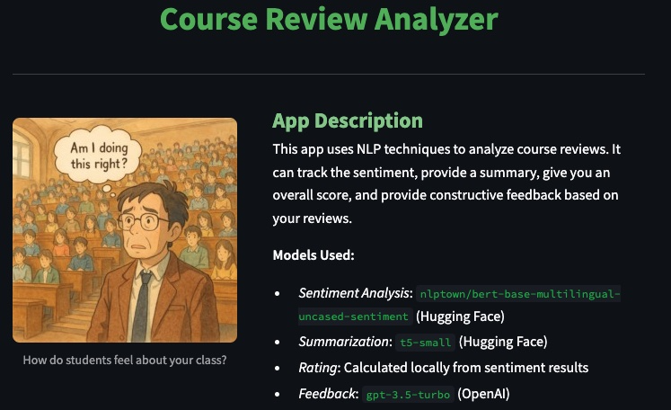
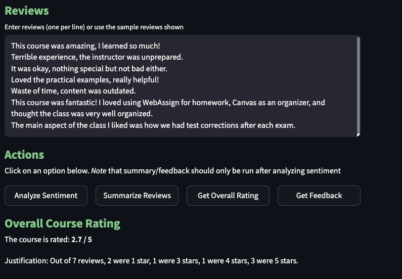

# Couse Review Analyzer Web App
### [Click here to use our Course Review Analyzer Streamlit App!](https://reviews-analyzer-bain.streamlit.app/)
## About
This small scale web app demonstrates the types of tasks we're building to quickly analyze large numbers of course reviews. Using Streamlit's cloud deployment services, it uses several different models to provide:
1. Sentiment Analysis
2. Text Summarization
3. Overall Course Rating
4. Constructive Feedback

Our goal with this project is to push course reviews towards a more modern paradigm akin to reviews for most products. We want to encourage more reviews with more detail/substance more frequently with a relatively low barrier to entry. We want to be able to scan these reviews quickly for *meaningful* commentary and quickly draw conclusions as to how to best help students. That was the goal of our "gibberish" detector; to be a filter for meaningful commentary rather than just nonsensical text. 

## Models
Streamlit places limits on storage and RAM for free-tier web apps, which limits our ability to deploy the models we've trained in this project. The models for gibberish detection and sentiment analysis that we have studied require extensive feature engineering that involves the use of high dimensional embeddings. Even for sentiment/summarization, there are very few models that are both effective *and* small enough to be loaded into a Streamlit instance without a high chance of it crashing. Thus, we've opted for small scale out-of-the-box models and APIs that do the same tasks as a demonstration of the tasks we're making tools for. These models include:
- *Sentiment Analysis*: `nlptown/bert-base-multilingual-uncased-sentiment` (Hugging Face)
- *Summarization*: `t5-small` (Hugging Face) or `gpt-3.5-turbo` (OpenAI)
- *Rating*: Calculated locally from sentiment results
- *Feedback*: `gpt-3.5-turbo` (OpenAI)

## Screenshots

