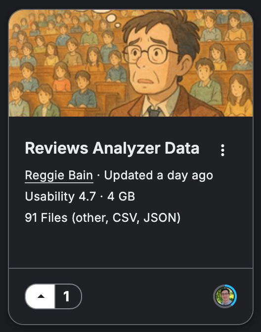

# Data
## [Master Kaggle Dataset (Click here)](https://www.kaggle.com/datasets/reggiebain/reviews-analyzer-dataset)

You can find our master kaggle dataset at the link above. It contains about 2.31 GB of data in total including the following:
- **Original datasets:** 
    - [Coursera Course Reviews](https://www.kaggle.com/datasets/imuhammad/course-reviews-on-coursera/data)
    - [Amazon Product Gibberish Text Classification](https://www.kaggle.com/datasets/johnwdata/gibberish-text-classification)

- **Engineered Feature Datasets:**
    - Course reviews with gibberish and sentiment features calculated
    - Product reviews with gibberish features calculated
    - Dataset of course reviews cleaned of "gibberish" (i.e. non-meaningful) text
    - Reference of ngram features calculated from product reviews
    - Centroid of embeddings of amazon product reviews

- **Models:**
    - Trained gibberish detection model
    - Trained classical ML sentiment detection model
    - Fine tuned pre-trained sentiment detection model (fine tuned form distilbert-base-uncased)

