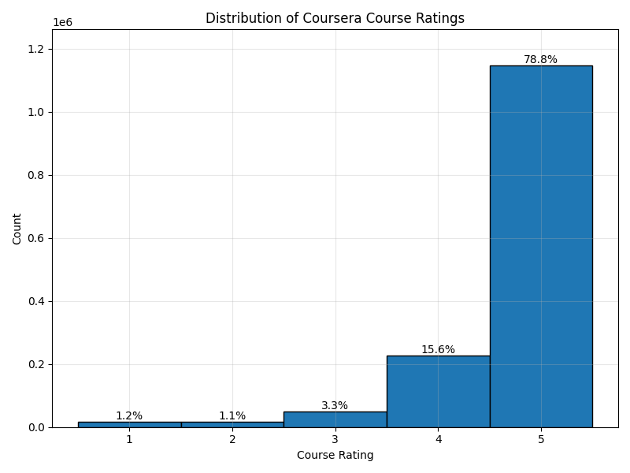

# Exploratory Data Analysis
## Coursera Reviews + Ratings

Potential Outliers (using IQR method):
| Institution | Average Rating | Number of Ratings |
|------------|----------------|-------------------|
| Advancing Women in Product | 4.33 | 9 | Low |
| ESCP Business School | 4.31 | 153 | Low |
| IE Business School | 4.01 | 82 | Low |
| LearnQuest | 4.32 | 246 | Low |
| New York Institute of Finance | 3.40 | 368 | Low |
| Novosibirsk State University  | 4.03 | 195 | Low |
| Saint Petersburg State University | 3.33 | 204 | Low |
| University of New Mexico | 1.00 | 6 | Low |
| Yandex | 3.42 | 290 | Low |
| **Overall Avg** | **4.65** | **1454711** | N/A |

