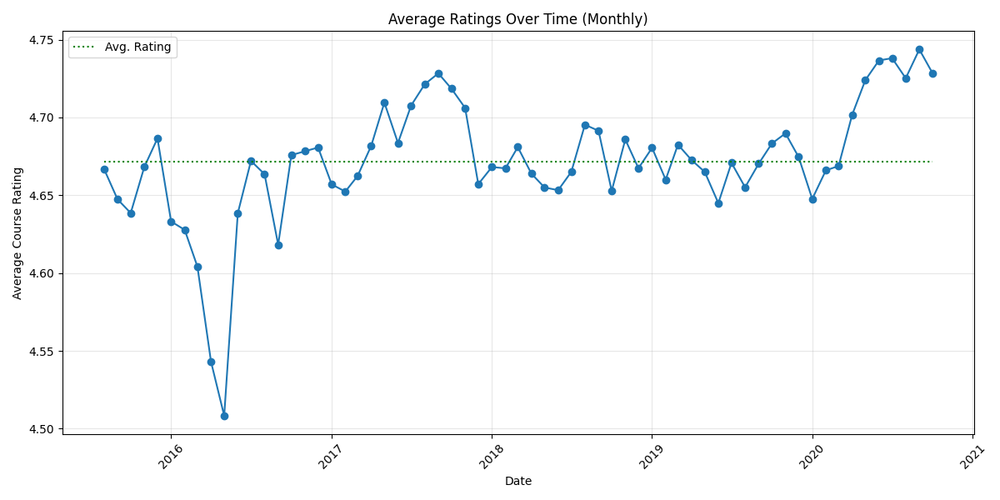
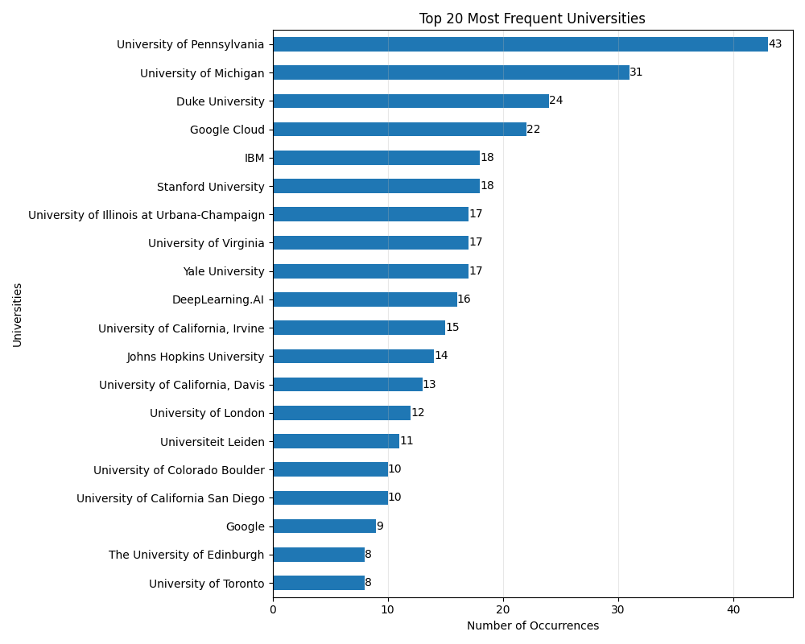
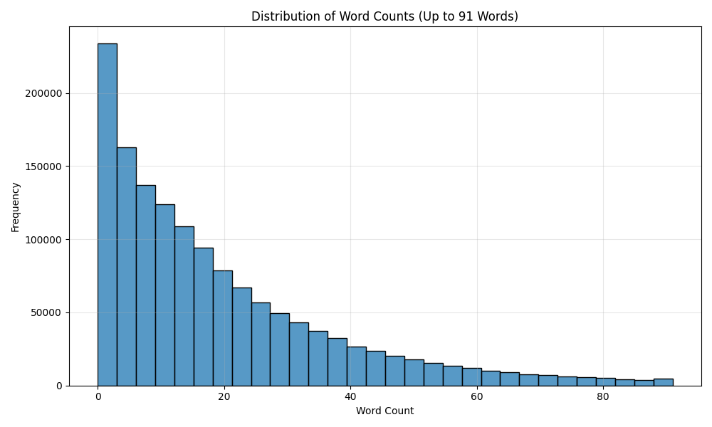
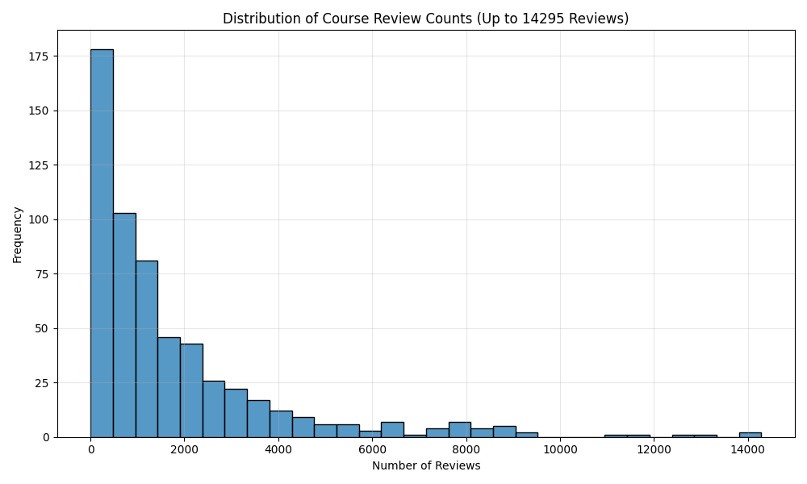

# Exploratory Data Analysis
## Coursera Reviews + Ratings

Potential Outliers (using IQR method):
| Institution | Average Rating | Number of Ratings |
|------------|----------------|-------------------|
| Advancing Women in Product | 4.33 | 9 | Low |
| ESCP Business School | 4.31 | 153 | Low |
| IE Business School | 4.01 | 82 | Low |
| LearnQuest | 4.32 | 246 | Low |
| New York Institute of Finance | 3.40 | 368 | Low |
| Novosibirsk State University  | 4.03 | 195 | Low |
| Saint Petersburg State University | 3.33 | 204 | Low |
| University of New Mexico | 1.00 | 6 | Low |
| Yandex | 3.42 | 290 | Low |
| **Overall Avg** | **4.65** | **1454711** | N/A |

Top 10 Languages % of Total
| Language | Pct of Total |
|--|--|
|English|81.83%|
|Spanish|6.76%|
|French|2.27%|
|Somali|1.36%|
|Romanian|1.10%|
|Portuguese|1.08%|
|Catalan|1.07%|
|Afrikaans|0.87%|
|Unknown|0.50%|
|Russian|0.44%|

Top 25 Languages Counts
| rank | language |   count |
|---|------------------------|--------|
|  1 | English                 | 1190455 |
|  2 | Spanish                 |   98361 |
|  3 | French                  |   33012 |
|  4 | Somali                  |   19826 |
|  5 | Romanian                |   15950 |
|  6 | Portuguese              |   15670 |
|  7 | Catalan                 |   15516 |\n
|  8 | Afrikaans               |   12633 |
|  9 | Unknown                 |    7202 |
|  10 | Russian                 |    6333 |
| 11 | German                  |    6304 |
| 12 | Italian                 |    4217 |
| 13 | Norwegian               |    3629 |
| 14 | Chinese                 |    3340 |
| 15 | Polish                  |    3179 |
| 16 | Tagalog                 |    2219 |
| 17 | Welsh                   |    2062 |
| 18 | Swahili (macrolanguage) |    2043 |
| 19 | Indonesian              |    1488 |
| 20 | Dutch                   |    1484 |
| 21 | Danish                  |    1421 |
| 22 | Vietnamese              |    1356 |
| 23 | Slovenian               |    1127 |
| 24 | Korean                  |     937 |
| 25 | Czech                   |     729 |