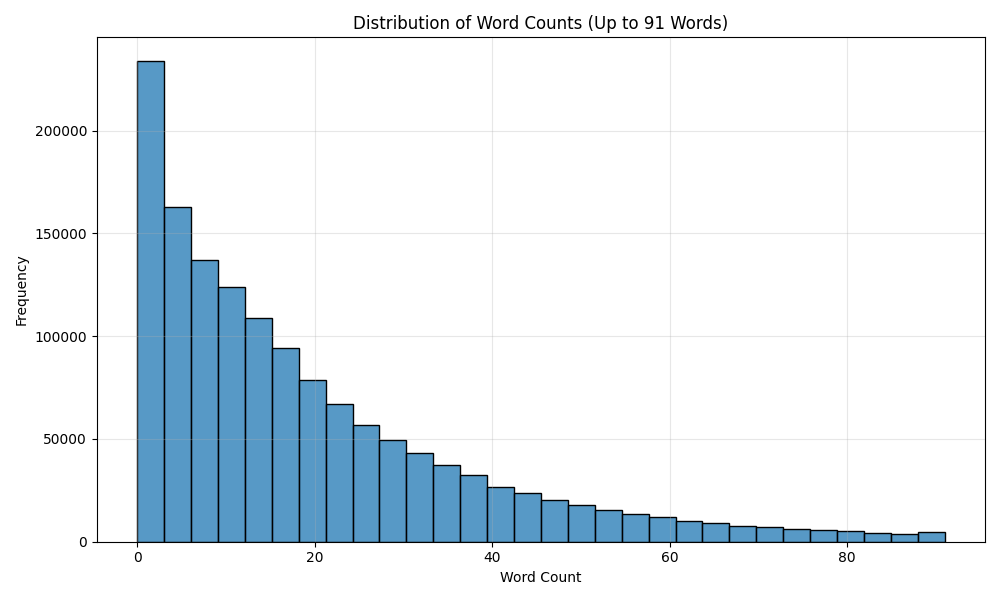
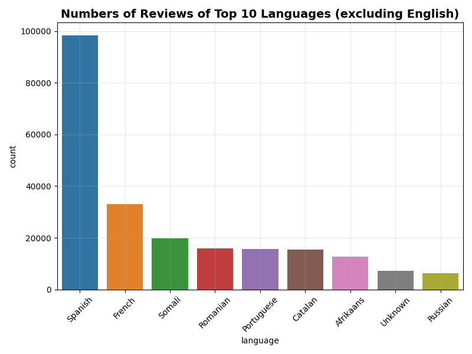
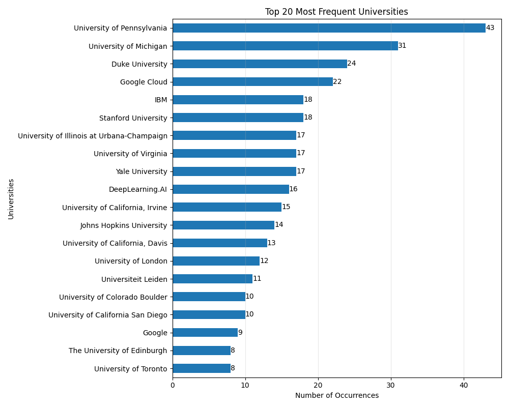
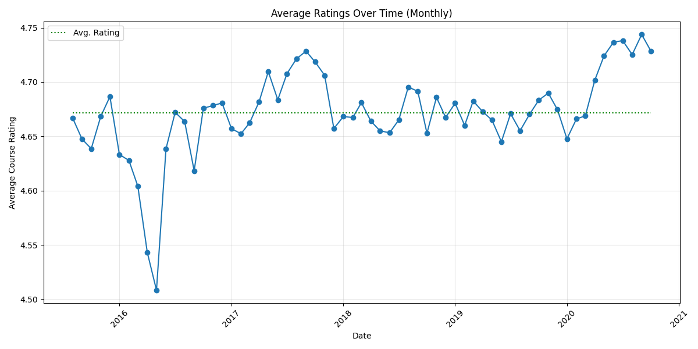
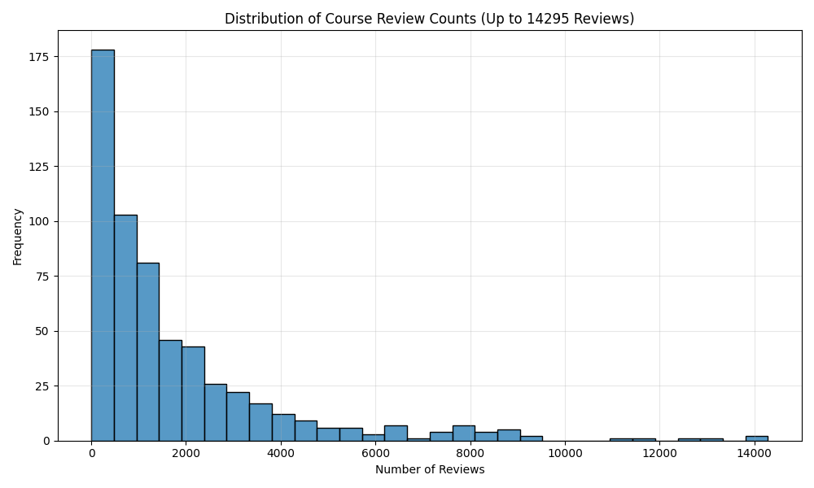
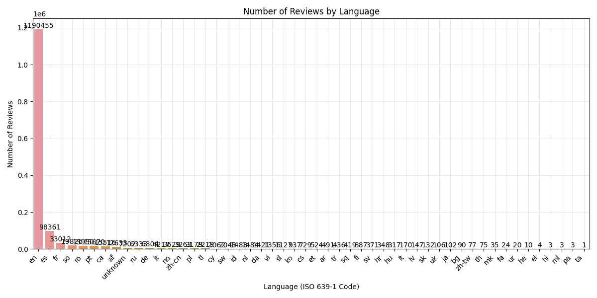

# Exploratory Data Analysis
## Exploring the Course Reviews
We found a large database of [reviews of Coursera courses on Kaggle](https://www.kaggle.com/datasets/imuhammad/course-reviews-on-coursera/data) that included details about the instructor, the course topic, the texts of real course reviews, and rating of the course from 1 to 5. 

The reviews varied significantly in length as can be seen below. However, they also had widely varying *quality*. Here are a few below:

| | **Sample Reviews** | 
|-- | -- |
| 1 |A fantastic course for beginners. Explaining underlying concepts in a easy and understandable way. Dr. Chuck is fantastic. |
| 2 |GOOOOOOOOOOOOOOOOOOOOOOOd |
| 3 | Great course for beginners. I studied all programming fundamentals in school and was just trying to learn Python. I found that this course is very good for anyone that is trying to learn fundaments of programming even you have no prior knowledge. |
| 4 | A Great Course! |
| 5 | Fue una experiencia gratificante el poder realizar el curso. La flexibilidad que permite y la calidad de la información, merece la mejor calificación  | 

The varying quality led to ask an interesting question *Can we make a model that discriminates between meaningful and gibberish or meaningless reviews?"* Our goal is to gain actionable insights from the reviews. There were 29,031 reviews with < 5 characters and 78,044 with fewer than 10 characters. A few of these are shown below:

| | **Gibberish/Meaningless Revews** |
| -- | -- |
| 1 | jhkd |
| 2 | das | 
| 3 | Good..!! |
| 4 | T | 

The meaningless reviews were not limited to short random letters. Some were longer (>10 characters) sequences of random letters and some reviews contain real words, but contain no significant content. Although a review of "Good course" would indicate positive sentiment, it does not contain meaningful insights. 
## Visualizing the Features
First, we took a look at distributions of various features including course ratings, word counts, langugages we could identify, and institutions/organizations from which the reviews came.
|  |  |
| -- | -- |
|  |  | 

We also tracked the average ratings over time to make sure that there wasn't any obvious trend or seasonality to the ratings. The only dip that occurred in 2016 was only an average about about 0.17 points. This would be interesting to study in a separate project. Questions like *Do ratings of an individual course change over time even as the content stay the same*

Potential Outliers (using IQR method):
| Institution | Average Rating | Number of Ratings |
|------------|----------------|-------------------|
| Advancing Women in Product | 4.33 | 9 | Low |
| ESCP Business School | 4.31 | 153 | Low |
| IE Business School | 4.01 | 82 | Low |
| LearnQuest | 4.32 | 246 | Low |
| New York Institute of Finance | 3.40 | 368 | Low |
| Novosibirsk State University  | 4.03 | 195 | Low |
| Saint Petersburg State University | 3.33 | 204 | Low |
| University of New Mexico | 1.00 | 6 | Low |
| Yandex | 3.42 | 290 | Low |
| **Overall Avg** | **4.65** | **1454711** | N/A |

|  |  |
|---|---|
|  | |

Top 10 Languages % of Total
| Language | Pct of Total |
|--|--|
|English|81.83%|
|Spanish|6.76%|
|French|2.27%|
|Somali|1.36%|
|Romanian|1.10%|
|Portuguese|1.08%|
|Catalan|1.07%|
|Afrikaans|0.87%|
|Unknown|0.50%|
|Russian|0.44%|

Top 25 Languages Counts
| rank | language |   count |
|---|------------------------|--------|
|  1 | English                 | 1190455 |
|  2 | Spanish                 |   98361 |
|  3 | French                  |   33012 |
|  4 | Somali                  |   19826 |
|  5 | Romanian                |   15950 |
|  6 | Portuguese              |   15670 |
|  7 | Catalan                 |   15516 |\n
|  8 | Afrikaans               |   12633 |
|  9 | Unknown                 |    7202 |
|  10 | Russian                 |    6333 |
| 11 | German                  |    6304 |
| 12 | Italian                 |    4217 |
| 13 | Norwegian               |    3629 |
| 14 | Chinese                 |    3340 |
| 15 | Polish                  |    3179 |
| 16 | Tagalog                 |    2219 |
| 17 | Welsh                   |    2062 |
| 18 | Swahili (macrolanguage) |    2043 |
| 19 | Indonesian              |    1488 |
| 20 | Dutch                   |    1484 |
| 21 | Danish                  |    1421 |
| 22 | Vietnamese              |    1356 |
| 23 | Slovenian               |    1127 |
| 24 | Korean                  |     937 |
| 25 | Czech                   |     729 |