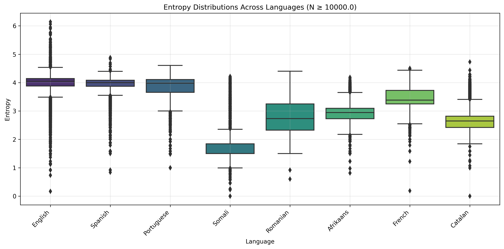
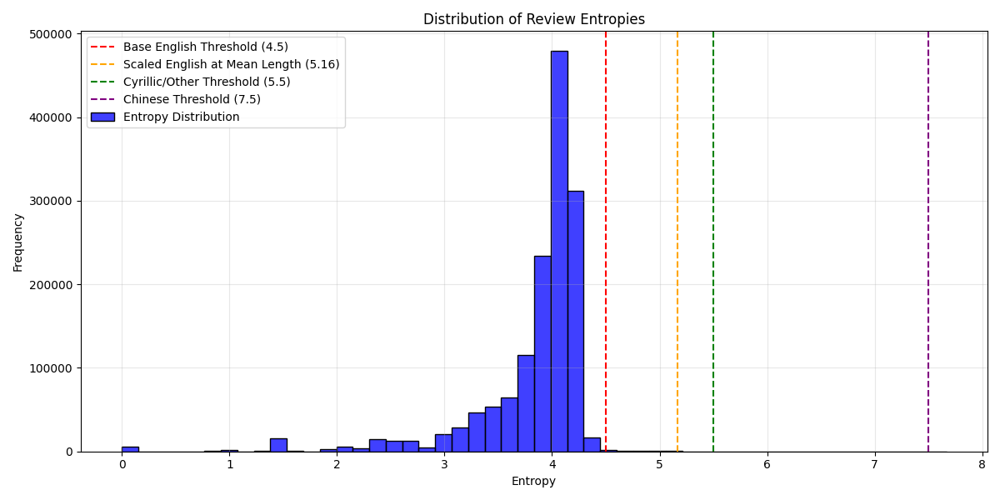
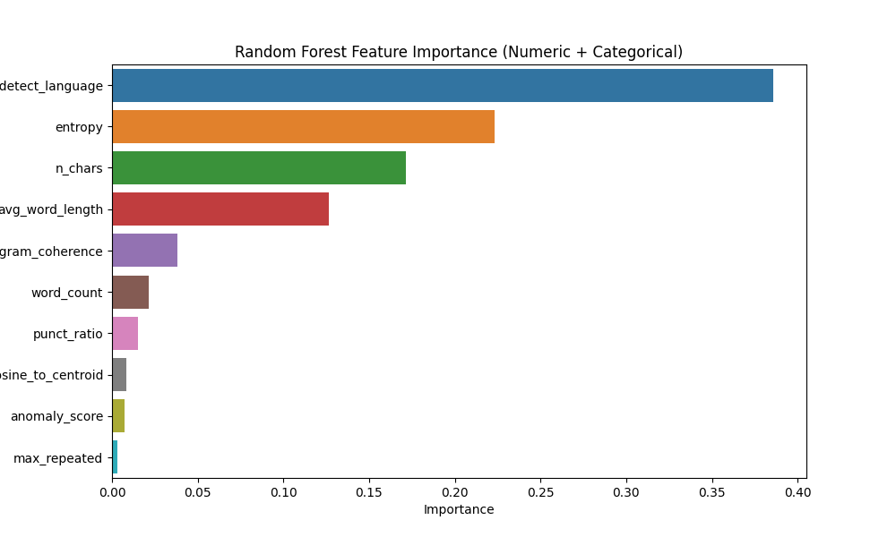
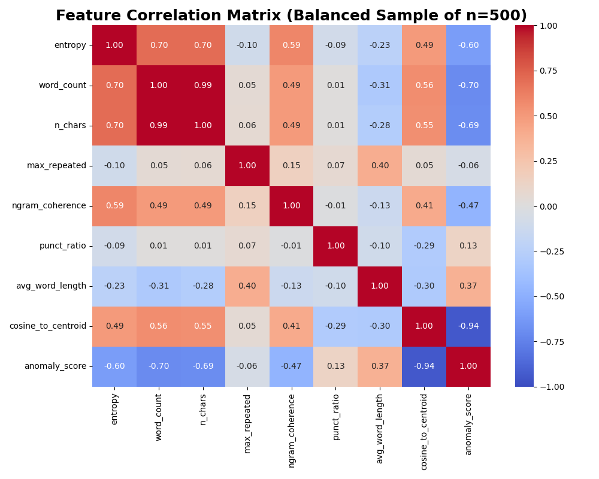
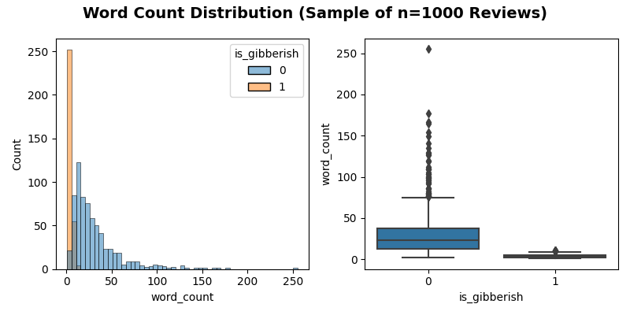
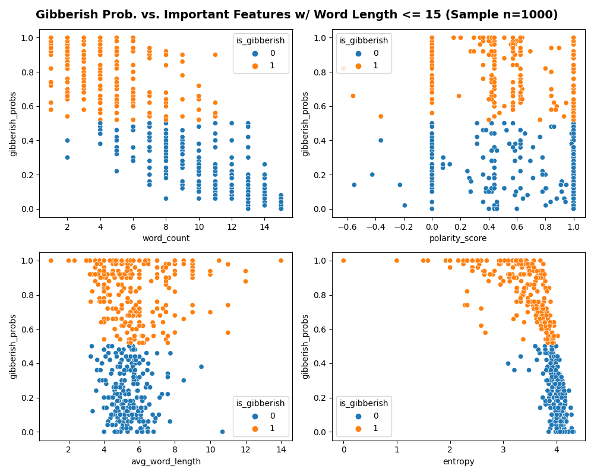
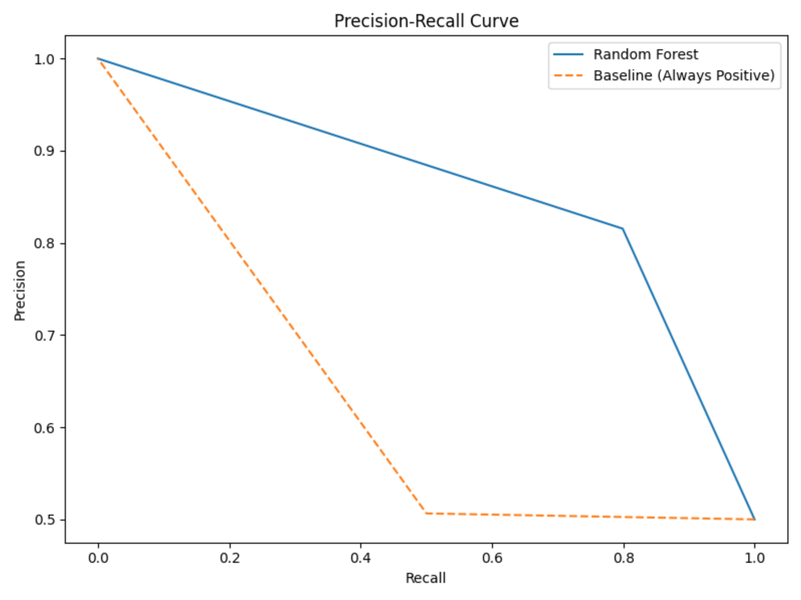
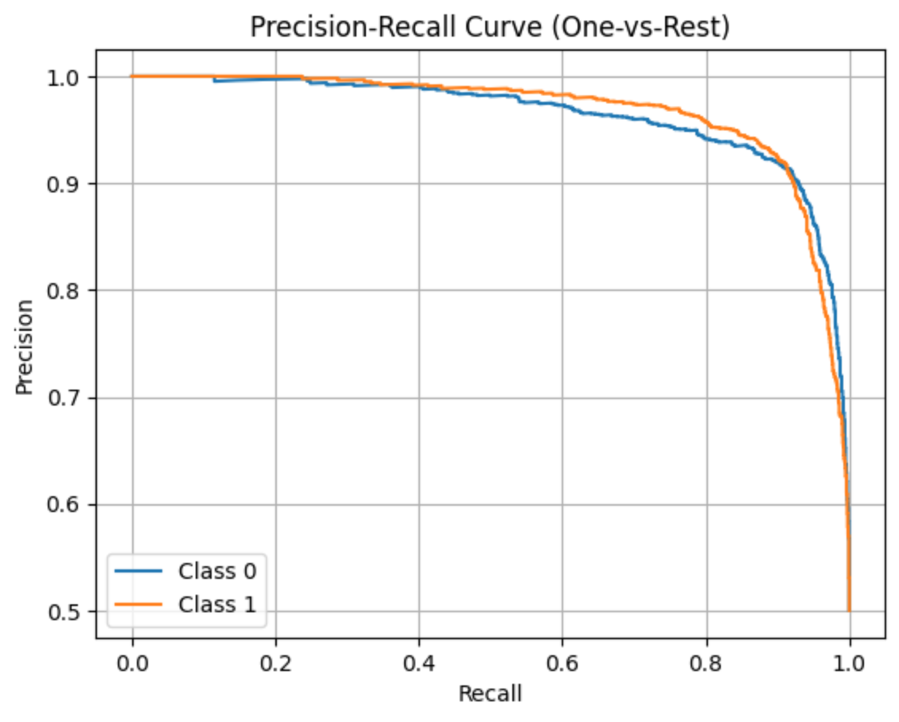

# Modeling
## Entropy Statistical Analysis
Before undertaking building our gibberish detection model, we sought to study entropy a bit more closely. Various sources (see https://arxiv.org/pdf/1606.06996) claim that entropy (at the character, word, and even sentence level) differs significantly by language. The distributions of character-level entropy for our Coursera reviews is below for the languages that had at least 10k reviews in our datset:

### Normality Test Results (Anderson-Darling)
In order to see if average entropy differs by language, we needed to establish what test was appropriate. We found that the entropy of the languages is not normally distributed for most language (see histogram below)

and the QQ-plots for the top languages below:

We also used the Anderson-Darling test and looked at skewness and kurtosis (which should be 0) to check  for normality. The results are shown below
| Language | Samples (N) | Normality Test | Skewness | Kurtosis |
|----------|-------------|----------------|----------|----------|
| English | 1,190,455 | Failed | -2.23 | 7.68 |
| Spanish | 98,361 | Failed | -3.04 | 12.86 |
| French | 33,012 | Failed | 0.32 | 0.19 |
| Somali | 19,826 | Failed | 2.19 | 4.21 |
| Romanian | 15,950 | Failed | 0.02 | -1.28 |
| Portuguese | 15,670 | Failed | -1.77 | 2.57 |
| Catalan | 15,516 | Failed | 1.38 | 1.77 |
| Afrikaans | 12,633 | Failed | -0.15 | 1.75 |
### Difference of Mean Entropies Analysis 
This non-normality motivated us to use the Kruskal-Wallis test (rather than ANOVA for example), which ultimately revealed that the average entropies were in fact statistically significantly different by language in our Coursera dataset!

| Kruskal-Wallis Test H Statistic | P-Value |
| -- | -- |
| 309537.92 | < 0.0001

For those interested, below is a larger box plot map of all languages with over 5 entries. We clearly see 

## Gibberish/Meaningful Review Classifier
#### Dataset
We explored the Coursera dataset and found a number of reviews that were gibberish and many more that were effectively meaningless, from which no actionable insights could be drawn. So, we explored another dataset of over 1 million Amazon product reviews where a number had already been labeled as gibberish. Our plan was to train and deploy this model on our Coursera dataset. The dataset had about 99.6% real and 0.4% gibberish reviews (which we figure is fairly realistic).
#### Feature Selection
Since gibberish does not occur very often (only about 4%) of the total entries in the Amazon product review dataset, we had to deal with some class imbalance issues. For trying to diagnose feature importance we temporarily balanced the classes and tried various sample sizes between 100 and 10k, we saw that the top 7 features were pretty consistent. 

We took two approaches to feature selection for our gibberish classifier. Using sci-kit learn's SelectKBest we calcualted f-statistics (the ratio of between group variance to in group variance) to gauge how strongly each feature was associated with gibberish and corresponding p-values (the probability of seeing an F-statistic this extreme if the feature has no relationship with it being gibberish). The results are below.
Balanced Sample Results:
|    | Feature            |       Score |      P-value |
|---:|:-------------------|------------:|-------------:|
|  0 | entropy            | 2381.23     | 1.45955e-266 |
|  1 | word_count         | 1866.44     | 9.96787e-231 |
|  2 | n_chars            | 1801.11     | 1.00156e-225 |
|  8 | anomaly_score      | 1763.43     | 8.69945e-223 |
|  7 | cosine_to_centroid |  721.201    | 5.35043e-120 |
|  4 | ngram_coherence    |  580.445    | 1.85507e-101 |
|  6 | avg_word_length    |  156.791    | 1.62205e-33  |
|  3 | max_repeated       |    4.82678  | 0.0282502    |
|  5 | punct_ratio        |    0.883225 | 0.347547     |

We also used the chi2 test to see if being able to detect the language was an important feature (along with other categorical variables that tested the alphabet) and indeed it was:
Balanced Sample Results:
|    | Feature                |   Score |       P-value |
|---:|:-----------------------|--------:|--------------:|
|  0 | cannot_detect_language |      40 |   2.53963e-10 |
|  5 | has_latin              |       0 |   1           |
|  1 | has_chinese            |     nan | nan           |
|  2 | has_cyrillic           |     nan | nan           |
|  3 | has_abakada            |     nan | nan           |
|  4 | has_hangul             |     nan | nan           |

The distribution of our numeric features for gibberish are shown below, separated by whether or not they were actually gibberish:

As another check (and since it could handle numerical and categorical features), we used a random forest to track feature importances, yielding the following results:
Feature Importance (All Features):
|    | Feature                |   Importance |
|---:|:-----------------------|-------------:|
|  9 | cannot_detect_language |   0.385838   |
|  0 | entropy                |   0.223072   |
|  2 | n_chars                |   0.171239   |
|  6 | avg_word_length        |   0.126694   |
|  4 | ngram_coherence        |   0.0380646  |
|  1 | word_count             |   0.021238   |
|  5 | punct_ratio            |   0.0149847  |
|  7 | cosine_to_centroid     |   0.00851155 |
|  8 | anomaly_score          |   0.00719214 |
|  3 | max_repeated           |   0.0031665  |

We then looked at the correlations between the features (shown below). 

Unsuprisingly, we had some very high correlations between, say n_chars, and word_count as well as cosine to centroid and anomaly score (considering both pairs are linearly dependent) so we opted to keep the features listed below:
1. Entropy
2. Word Count
3. Max Repeated
4. Ngram coherence
5. Punctuation Ratio
6. Average Word Length
7. Anomaly Score
8. Cannot Detect Language

We ran a number of experiments on large samples of the data before finally running the model on the entire data set for deployment. For tuning the model we used a 50k sample size.

### Model Comparison (Test Set Results)
The results of the gibberish detector are summarized below against 3 different baselines:
1. Determine the % of reviews in the training set that are gibberish. Then guess that % of the test set is gibberish.
2. Use only the "cannot_detect_language_feature" and mark all reviews where we can't detect it as gibberish.
3. Guess that all reviews are not gibberish.

| Model                         | Best Parameters                                              |   Precision (Gibberish) |   Recall (Gibberish) |   F1-Score (Gibberish) |   ROC AUC |     PR AUC |
|:------------------------------|:-------------------------------------------------------------|------------------------:|---------------------:|-----------------------:|----------:|-----------:|
| Logistic Regression           | {'C': 10, 'solver': 'lbfgs'}                                 |                0.981579 |            0.992021  |               0.986772 |  0.998902 | 0.995229   |
| Random Forest                 | {'max_depth': 10, 'n_estimators': 50}                        |                0.997319 |            0.989362  |               0.993324 |  0.997338 | 0.996728   |
| SVM                           | {'C': 10, 'kernel': 'linear'}                                |                0.98939  |            0.992021  |               0.990704 |  0.999187 | 0.993797   |
| Gradient Boosting             | {'learning_rate': 0.01, 'max_depth': 3, 'n_estimators': 100} |                0.989333 |            0.986702  |               0.988016 |  0.994653 | 0.982619   |
| Baseline (Random Guess)       | Gibberish Prob = 0.00358                                     |                0        |            0         |               0        |  0.49825  | 0.00178649 |
| Baseline (Lang Not Detected)  | cannot_detect_language = 1                                   |                1        |            0.0851064 |               0.156863 |  0.542553 | 0.544188   |
| Baseline (None are gibberish) | None Gibberish                                               |                0        |            0         |               0        |  0.5      | 0.501786   |

The results above show that our trained models improve on identifying gibberish far better than our baselines. **Note:** If we tracked precision/recall of identifying NOT gibberish (i.e. real/meaningful reviews), the baselines would do much better, but the recall of gibberish reviews would still not be good.

### Deploying the Model
We then pickled our gibberish detector and applied it to our dataset of Coursera course reviews. After calculating the necessary features to apply the model, we studied which reviews the model labeled as gibberish. [See this notebook for more details about our analysis.](../eda/coursera-extract-gibberish-features-nonscript%20(2).ipynb)  We found that the model was classifying a lot of short reviews as "gibberish"

| Stat (N=1000 Sample) | Value | 
| -- | -- |
| No. Short Entries that are Gibberish | 290 |
| No. Short Entries Total | 516|
| Pct Short Entries that are Gibberish | 56.20%|
| Pct Gibberish Entries that are Short | 100.00%|

We also looked at several different features and how they affected the likelihood of being classified as gibberish:

We also experimented with probability cutoffs to see how many reviews were marked as gibberish as we changed the cutoffs to try to minimize classifying short (but not meaningless reviews) as gibberish:

Ultimately, we decided to do use a hybrid approach where we set our threshold to 0.9 to get classified as gibberish and we checked that at least 75% of the words had to be real words (using Python Word Frequency package). This allowed us to classify a about 6% of reviews as "gibberish." However, these reviews would probably better be described as "meaningless" where no actionable insights can be gained from them but they are often positive or negative, so they are potentially useful for detecting sentiment.
## Sentiment Prediction Model
[See our notebook here for details on extracting the features for building our sentiment model.](./sentiment-analysis-model.ipynb)
### Sentiment Feature Selection

1. Polarity Score
2. Exclamation Count
3. Word Count
4. Avg Word Length
5. Punct Ratio
6. Anomaly Score
### Run with Balanced Dataset
| Model                      |   Accuracy |   F1 Score |   Precision |   Recall | Best Hyperparameters                                        |
|----------------------------|------------|------------|-------------|----------|-------------------------------------------------------------|
| Logistic Regression        |   0.791821 |   0.842668 |    0.929867 | 0.791821 | {'C': 1}                                                    |
| Random Forest              |   0.959875 |   0.954458 |    0.95547  | 0.959875 | {'max_depth': None, 'n_estimators': 200}                    |
| XGBoost Classifer          |   0.827681 |   0.867041 |    0.934121 | 0.827681 | {'learning_rate': 0.2, 'max_depth': 7, 'n_estimators': 200} |
| Baseline (Always Positive) |   0.939662 |   0.910431 |    0.882964 | 0.939662 | N/A 
| Distilbert-base-uncased (out-of-box) |   0.250722 |   0.345742 |    0.853837 | 0.250722 |
| Distilbert-base-uncased (fine tuned) | 0.962897 | 0.959677 | 0.959309 | 0.962897 |

### Run with Original, Unbalanced Dataset
| Model                      |   Accuracy |   F1 Score |   Precision |   Recall | Best Hyperparameters                                        |
|----------------------------|------------|------------|-------------|----------|-------------------------------------------------------------|
| Logistic Regression        |   0.791821 |   0.842668 |    0.929867 | 0.791821 | {'C': 1}                                                    |
| Random Forest              |   0.959875 |   0.954458 |    0.95547  | 0.959875 | {'max_depth': None, 'n_estimators': 200}                    |
| XGBoost Classifer          |   0.827681 |   0.867041 |    0.934121 | 0.827681 | {'learning_rate': 0.2, 'max_depth': 7, 'n_estimators': 200} |
| Baseline (Always Positive) |   0.939662 |   0.910431 |    0.882964 | 0.939662 | N/A
| Distilbert-base-uncased (out-of-box) |   0.250722 |   0.345742 |    0.853837 | 0.250722 |
| Distilbert-base-uncased (fine tuned) | 0.962897 | 0.959677 | 0.959309 | 0.962897 |

