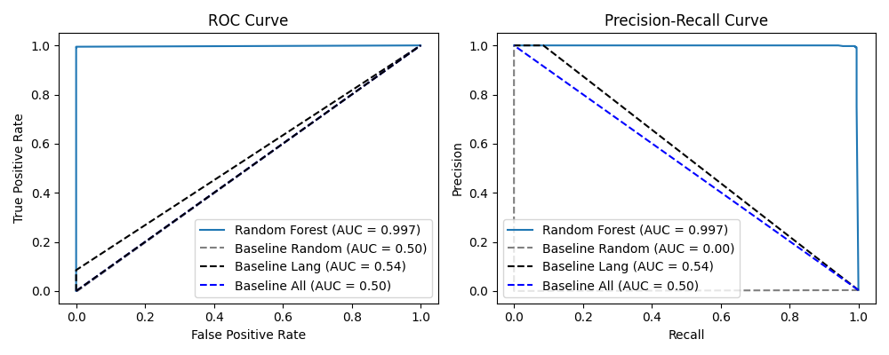

# Modeling
## 1. Entropy Statistical Analysis
### What is Entropy?

In NLP, **entropy** measures the uncertainty or information content in a **language model's probability distribution** over possible next tokens or words.

$H(p) = -\sum\left[p(wᵢ) * \log₂ \left( p(wᵢ)\right)\right]$
- `H(p)`: Entropy of the probability distribution `p` over a vocabulary  
- `p(wᵢ)`: Probability assigned to word/token `wᵢ` by a language model  
- `n`: Total number of possible words/tokens in the vocabulary

This can be calcualted at the character, word, or sentence level. Gibberish text (e.g., "asdf asdf lkjweoiur qwe!") could tend to have high entropy because characters are random or nonsensical, there’s little repetition or pattern and because the distribution of characters is fairly uniform. As a first step in identifying meaningless reviews, we explored the entropy of reviews as a possible feature.

### Entropy in Different Languages
Before undertaking building our gibberish detection model, we sought to study entropy a bit more closely. Various sources (see https://arxiv.org/pdf/1606.06996) claim that entropy (at the character, word, and even sentence level) differs significantly by language. The distributions of character-level entropy for our Coursera reviews is below for the languages that had at least 10k reviews in our datset:

### Normality Test Results (Anderson-Darling)
In order to see if average entropy differs by language, we needed to establish what test was appropriate. We found that the entropy of the languages is not normally distributed for most language (see histogram below)

 

and the QQ-plots for the top languages below:

 

We also used the Anderson-Darling test and looked at skewness and kurtosis (which should be 0) to check  for normality. The results are shown below:
| Language | Samples (N) | Normality Test | Skewness | Kurtosis |
|----------|-------------|----------------|----------|----------|
| English | 1,190,455 | Failed | -2.23 | 7.68 |
| Spanish | 98,361 | Failed | -3.04 | 12.86 |
| French | 33,012 | Failed | 0.32 | 0.19 |
| Somali | 19,826 | Failed | 2.19 | 4.21 |
| Romanian | 15,950 | Failed | 0.02 | -1.28 |
| Portuguese | 15,670 | Failed | -1.77 | 2.57 |
| Catalan | 15,516 | Failed | 1.38 | 1.77 |
| Afrikaans | 12,633 | Failed | -0.15 | 1.75 |
### Difference of Mean Entropies Analysis 
This non-normality motivated us to use the Kruskal-Wallis test (rather than ANOVA for example), which ultimately revealed that the average entropies were in fact statistically significantly different by language in our Coursera dataset!

| Kruskal-Wallis Test H Statistic | P-Value |
| -- | -- |
| 309537.92 | < 0.0001

For those interested, below is a larger box plot map of all languages with over 5 entries. We see clear differences in the entropy distributions of some languages, particularly chinese/japanese vs. languages like Dutch and Danish.

 

## 2. Gibberish/Meaningful Review Classifier
#### Dataset
We explored the Coursera dataset and found a number of reviews that were gibberish and many more that were effectively meaningless, from which no actionable insights could be drawn. So, we explored another dataset of over 1 million Amazon product reviews where a number had already been labeled as gibberish. Our plan was to train and deploy this model on our Coursera dataset. The dataset had about 99.6% real and 0.4% gibberish reviews (which we figure is fairly realistic).
#### Feature Selection
Since gibberish does not occur very often (only about 4%) of the total entries in the Amazon product review dataset, we had to deal with some class imbalance issues. For trying to diagnose feature importance we temporarily balanced the classes and tried various sample sizes between 100 and 10k, we saw that the top 7 features were pretty consistent. 

We constructed a handful of NLP related features (many of which are self-explanatory such as word count) including:
- **Cosine-to-Centroid and Anomaly Score** - We calculated embeddings of all of our reviews (in both the amazon and coursera datasets). Then we found the Euclidean distance from each embedding to the centroid of the Amazon review set embeddings.
- **N-gram coherence** – Measures how frequently word sequences appear in natural language to help identify if text uses realistic word combinations of n-grams. The formula for this is basically:

  - $\text{N-gram Coherence} = \frac{\text{Number of Valid N-grams in Text}}{\text{Total Number of N-grams in Text}}$

We took two approaches to feature selection for our gibberish classifier. Using sci-kit learn's SelectKBest we calcualted f-statistics (the ratio of between group variance to in group variance) to gauge how strongly each feature was associated with gibberish and corresponding p-values (the probability of seeing an F-statistic this extreme if the feature has no relationship with it being gibberish). The results are below.
Balanced Sample Results:
|    | Feature            |       Score |      P-value |
|---:|:-------------------|------------:|-------------:|
|  0 | entropy            | 2381.23     | 1.45955e-266 |
|  1 | word_count         | 1866.44     | 9.96787e-231 |
|  2 | n_chars            | 1801.11     | 1.00156e-225 |
|  8 | anomaly_score      | 1763.43     | 8.69945e-223 |
|  7 | cosine_to_centroid |  721.201    | 5.35043e-120 |
|  4 | ngram_coherence    |  580.445    | 1.85507e-101 |
|  6 | avg_word_length    |  156.791    | 1.62205e-33  |
|  3 | max_repeated       |    4.82678  | 0.0282502    |
|  5 | punct_ratio        |    0.883225 | 0.347547     |

We also used the chi2 test to see if being able to detect the language was an important feature (along with other categorical variables that tested the alphabet) and indeed it was:
Balanced Sample Results:
|    | Feature                |   Score |       P-value |
|---:|:-----------------------|--------:|--------------:|
|  0 | cannot_detect_language |      40 |   2.53963e-10 |
|  5 | has_latin              |       0 |   1           |
|  1 | has_chinese            |     nan | nan           |
|  2 | has_cyrillic           |     nan | nan           |
|  3 | has_abakada            |     nan | nan           |
|  4 | has_hangul             |     nan | nan           |

The distribution of our numeric features for gibberish are shown below, separated by whether or not they were actually gibberish:
 

As another check (and since it could handle numerical and categorical features), we used a random forest to track feature importances and studied the correlations between the features (shown below):
Feature Importance (All Features):
|    | Feature                |   Importance |
|---:|:-----------------------|-------------:|
|  9 | cannot_detect_language |   0.385838   |
|  0 | entropy                |   0.223072   |
|  2 | n_chars                |   0.171239   |
|  6 | avg_word_length        |   0.126694   |
|  4 | ngram_coherence        |   0.0380646  |
|  1 | word_count             |   0.021238   |
|  5 | punct_ratio            |   0.0149847  |
|  7 | cosine_to_centroid     |   0.00851155 |
|  8 | anomaly_score          |   0.00719214 |
|  3 | max_repeated           |   0.0031665  |

<table>
  <tr>
    <td></td>
    <td>
  </tr>
</table>

We also 
Unsuprisingly, we had some very high correlations between, say n_chars, and word_count as well as cosine to centroid and anomaly score (considering both pairs are linearly dependent) so we opted to keep the features listed below. Although some seemed to have low importance, the number of features is still quite small and several (like punctuation ratio and average word length) come at low computational cost:
1. Entropy
2. Word Count
3. Max Repeated
4. Ngram coherence
5. Punctuation Ratio
6. Average Word Length
7. Anomaly Score
8. Cannot Detect Language

We ran a number of experiments on large samples of the data before finally running the model on the entire data set for deployment. For tuning the model we used a 50k sample size.

### Model Comparison (Test Set Results)
The results of the gibberish detector are summarized below against 3 different baselines:
1. Determine the % of reviews in the training set that are gibberish. Then guess that % of the test set is gibberish.
2. Use only the "cannot_detect_language_feature" and mark all reviews where we can't detect it as gibberish.
3. Guess that all reviews are not gibberish.

 

| Model                         | Best Parameters                                              |   Precision (Gibberish) |   Recall (Gibberish) |   F1-Score (Gibberish) |   ROC AUC |     PR AUC |
|:------------------------------|:-------------------------------------------------------------|------------------------:|---------------------:|-----------------------:|----------:|-----------:|
| Logistic Regression           | {'C': 10, 'solver': 'lbfgs'}                                 |                0.981579 |            0.992021  |               0.986772 |  0.998902 | 0.995229   |
| Random Forest                 | {'max_depth': 10, 'n_estimators': 50}                        |                0.997319 |            0.989362  |               0.993324 |  0.997338 | 0.996728   |
| SVM                           | {'C': 10, 'kernel': 'linear'}                                |                0.98939  |            0.992021  |               0.990704 |  0.999187 | 0.993797   |
| Gradient Boosting             | {'learning_rate': 0.01, 'max_depth': 3, 'n_estimators': 100} |                0.989333 |            0.986702  |               0.988016 |  0.994653 | 0.982619   |
| Baseline (Random Guess)       | Gibberish Prob = 0.00358                                     |                0        |            0         |               0        |  0.49825  | 0.00178649 |
| Baseline (Lang Not Detected)  | cannot_detect_language = 1                                   |                1        |            0.0851064 |               0.156863 |  0.542553 | 0.544188   |
| Baseline (None are gibberish) | None Gibberish                                               |                0        |            0         |               0        |  0.5      | 0.501786   |

The results above show that our trained models improve on identifying gibberish far better than our baselines. **Note:** If we tracked precision/recall of identifying NOT gibberish (i.e. real/meaningful reviews), the baselines would do much better, but the recall of gibberish reviews would still not be good.

### Deploying the Model
We then pickled our gibberish detector and applied it to our dataset of Coursera course reviews. After calculating the necessary features to apply the model, we studied which reviews the model labeled as gibberish. [See this notebook for more details about our analysis.](../eda/coursera-extract-gibberish-features-nonscript%20(2).ipynb)  We found that the model was classifying a lot of short reviews as "gibberish"

| Stat (N=1000 Sample) | Value | 
| -- | -- |
| No. Short Entries that are Gibberish | 290 |
| No. Short Entries Total | 516|
| Pct Short Entries that are Gibberish | 56.20%|
| Pct Gibberish Entries that are Short | 100.00%|

 

We also looked at several different features and how they affected the likelihood of being classified as gibberish (see below). It seems clear that the gibberish detector primarily targets shorter reviews:
 

We also experimented with probability cutoffs to see how many reviews were marked as gibberish as we changed the cutoffs to try to minimize classifying short (but not meaningless reviews) as gibberish:
 

Ultimately, we decided to do use a hybrid approach where we set our probability threshold to 0.9 (rather than the default of 0.5) to get classified as gibberish and we checked that at least 75% of the words had to be real words (using Python Word Frequency package). This allowed us to classify a about 6% of reviews as "gibberish." However, these reviews would probably better be described as "meaningless" where no actionable insights can be gained from them but they are often positive or negative, so they are potentially useful for detecting sentiment. So in summary, there's a few insights/ideas here:
1. **Pro of Model:** Shorter reviews are unlikely to yield any actionable insights anyway. Based on the plots above, adjusting the probablity threshold allows us to minimze losing reviews that, while not *insightful* do can contribute strong positive/negative sentiment.
2. **Cons of Model/Areas for Improvement:** This is *not* just detecting "gibberish." Additionally, it could be subject to malicious entries that contain real words in a random order. *To improve:* our next step would be to incorporate *sentence-level-entropy* to track how likely we are to see that type of sentence. 

## 3. Sentiment Prediction Model
[See our notebook here for details on extracting the features for building our sentiment model.](./sentiment-analysis-model.ipynb)
### Sentiment Feature Selection
We sought to build models to predict sentiment of course reviews. We did 3 main approaches:
1. **Classical ML Approach:** Extract features, put into LogisticRegression, Random Forest, boosted tree based algorithms.
2. **Out-of-Box Transformer:** Use a reasonably sized out of the box transformer model like `distilbert-base-uncased` to judge sentiment for comparison
3. **Fine-Tuned Transformer:** Fine tune the same model on our course review data.

### Feature Extraction
We built a number of NLP relevant sentiment features. [Click here to see the notebook](./sentiment-analysis-model.ipynb). Using a random forest to track feature importances (which ones when split on reduce entropy/gini impurity the most) and then mapping the correlations between our features we settled on the ones listed below. 

<table>
  <tr>
    <td></td>
    <td>
  </tr>
</table>

**1. Polarity Score --** Sentiment score from [VADER](https://github.com/cjhutto/vaderSentiment), ranging from -1 (negative) to +1 (positive), used to capture the overall tone of the review.

**2. Exclamation Count --**
Number of exclamation marks, used as a proxy for emotional intensity in the text.

**3. Word Count --**
Total number of words in the review, indicating verbosity or expressiveness.

**4. Average Word Length --**
Mean number of characters per word; can reflect tone or formality.

**5. Punctuation Ratio --**
Ratio of punctuation marks to total characters, used to capture emphasis or writing style.

**6. Anomaly Score --**
Distance of the review's embedding (using `xlm-roberta-base` to create multi-language embeddings) from the centroid of all embeddings; helps flag outlier or off-topic content.

### Modeling Sentiment
Our original Coursera dataset was highly imbalanced, containing mostly positive reviews as shown below.

. 

However, with millions of datapoints, we still had plenty of negative/neutral reviews to work with. We decided to try to model 2 different ways:

#### Appraoch 1 -- Balance Positive vs. Negative
- Define positive as 4/5 star ratings and negative as 1-3 star ratings. We tried throwing out 3 star ratings after classifying them as neutral, but we found that many 3 star ratings had substantive criticism with useful insights.
- Undersample positive ratings so as to create a sample balanced between positive and negative reviews. 
- Compare classical ML, out-of-box transformer, fine tuned transformer, and several baselines (including randomly guessing that review was positive/negative).

| Model                      |   Accuracy |   F1 Score |   Precision |   Recall | Best Hyperparameters                                        |
|----------------------------|------------|------------|-------------|----------|-------------------------------------------------------------|
| Logistic Regression        |   0.75626  |   0.755858 |    0.757963 | 0.75626  | {'C': 0.01}                                                 |
| Random Forest              |   0.812465 |   0.812458 |    0.812512 | 0.812465 | {'max_depth': None, 'n_estimators': 200}                    |
| XGBoost Classifer          |   0.782693 |   0.782604 |    0.783161 | 0.782693 | {'learning_rate': 0.1, 'max_depth': 7, 'n_estimators': 200} |
| Baseline (Random Guess) |   0.5064   |   0.506381 |    0.506401 | 0.5064   | N/A |
| Distilbert-base-uncased (out-of-box) |   0.526989 |   0.421286 |    0.600188 | 0.526989 | N/A|
| Distilbert-base-uncased (fine-tuned) | 0.913189| 0.913172 | 0.913509 | 0.913189 | N/A |

 

<table>
  <tr>
    <td></td>
    <td>
  </tr>
</table>

- *Why did we try balancing the dataset? --* Although this is speculative, I expect that different university courses taught in a more traditional manner would not all have rating distributions that are this positive. I would expect relatively high kurtosis in many courses (where the feeling of students is overwhelmingly positive/negative) and would expect high skewness in such cases, but many other courses would have a flatter distribution as well. For online courses, I think the psychology of students is a bit different than, for example, large enrollment undergraduate courses where students are enrolled due to graduation requirements. In online courses, enrollees are either students seeking additional coursework voluntarily or working professionals looking to upskill. Both of these I think breeds a generally more positive outlook.
- Thus, I was interested to look at how the classifier would look for a distribution that wasn't so overwhelmingly skewed positive. The Random Forest Classifier shows a 60.5% increase in F1 score from the baseline of randomly guessing positive vs. negative sentiment. 
- The best performing model is, unsurprisingly, the fine-tuned pre-trained model at around 91% across the board with precision, recall, and F1 score. Both the classical and fine-tuned tranformer models significantly outperform the out-of-the-box transformer as well.

#### Approach 2 -- Unbalanced Original Dataset with Class Weights
- Use the original unbalanced dataset of reviews but allow the ML models to penalize classifying negative as positive using class weights.

| Model                      |   Accuracy |   F1 Score |   Precision |   Recall | Best Hyperparameters                                        |
|----------------------------|------------|------------|-------------|----------|-------------------------------------------------------------|
| Logistic Regression        |   0.791821 |   0.842668 |    0.929867 | 0.791821 | {'C': 1}                                                    |
| Random Forest              |   0.959875 |   0.954458 |    0.95547  | 0.959875 | {'max_depth': None, 'n_estimators': 200}                    |
| XGBoost Classifer          |   0.827681 |   0.867041 |    0.934121 | 0.827681 | {'learning_rate': 0.2, 'max_depth': 7, 'n_estimators': 200} |
| Baseline (Always Positive) |   0.939662 |   0.910431 |    0.882964 | 0.939662 | N/A 
| Distilbert-base-uncased (out-of-box) |   0.250722 |   0.345742 |    0.853837 | 0.250722 |
| Distilbert-base-uncased (fine tuned) | 0.962897 | 0.959677 | 0.959309 | 0.962897 |

<table>
  <tr>
    <td></td>
    <td>
  </tr>
</table>

- For the original dataset, the Random Forest Classifier model out performs the baseline of always guessing that the sentiment is positive (which performs well since over 99% of the reviews are actually positive **before removing gibberish reviews**) by about 4.8% in F1 score and 8.2% in precision.
- Again, the fine-tuned transformer also out performs the baseline and both the classical ML and fine-tuned transformers significantly outperform the out-of-the-box transformer. The fine-tuning was only run for 1 epoch, so with additional, epochs, it's likely that performance would continue to improve.
- Although these are relatively small improvements, with more epochs and a more robust set of negative reviews, the models' performance would continue to improve over the baseline.

## Conclusions
#### 1. Entropy Analysis
- Average Entropy (calculated at the character level) did differ significantly by language. In our dataset of course reviews, the average entropy was not normally distributed and the Kruskal Wallis test was thus used to show differences in mean entropy by language.
- Entropy is a classical NLP feature that serves as an interesting and important feature in predicting gibberish/meaninglessness.

#### 2. Gibberish Classifier
- We created a model that classifies gibberish reviews from non-gibberish/meaningless reviews. The model was trained on Amazon product review data and then deployed on our Coursera review set.
- The most important NLP features included whether or not the language of the review could be detected, the entropy of the review, the word count, and the ngram coherence.
- Our model showed significant improvement over all of the baselines we chose, consistently having much higher recall on identifying the true gibberish reviews. The model also showed a 533.3% increase in performance over a baseline where we only used whether we could detect the language to classify a review as gibberish.
- The classifier tended to over classify short reviews that didn't contain a lot of meaning as "gibberish" and we raised the prediction threshold to help aleviate this error in deployment. 

#### 3. Sentiment Analyzer
- We created several models that predict the sentiment of course reviews better than various baseline models using several appraoches.
- Our first appraoch utilized classical NLP features and ML techniques including embeddings, n-grams, and polarity (leveraging VADER). We saw a 60.5% performance increase on the balanced (between positive/negative) dataset of reviews and an 8.2% improvement over baseline in the unbalanced dataset.
- We also tried fine-tuning a pre-trained transformer model `distilbert-base-uncased` to predict sentiment, which worked quite well. In the balanced dataset, it showed an 80.4% increase in F1 score from the baseline and a 117% increase over the out-of-the-box distilbert model. In the unbalanced dataset, it showed 5.4% increase in F1 score over the baseline and 177% increase over the out-of-the-box model.
- Additionally, all of these improvements came with just 1 epoch of training (which was limited using a free tier of Kaggle GPUs).

## Future Work
- Going forward, we need to continue to fine tune our Gibberish classifier focusing particularly on edge cases such as long strings of real words arranged in random, meaningless order.
- We also would like to train the gibberish model on a much larger (1-2 orders of magnitude) set of labeled truly gibberish reviews. This could be achieved by hand labeling a few hundred/thousand reviews and/or generating gibberish of specified structure using an LLM.
- For our sentiment analyzer, we need to find more training data with a much (1-2 orders of magnitude) larger set of explicitly negative reviews of varying length and structure.
- For actual deployment, the fine tuning of a pre-trained neural network will likely outperform any of our classical feature based approaches. So, we'd like to train for many more epochs (50+ or however many needed until validation performance dips).